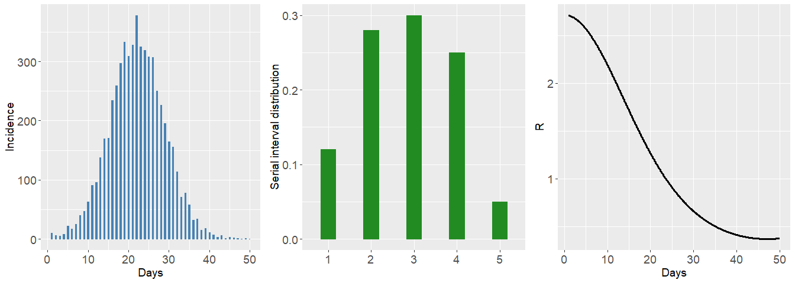
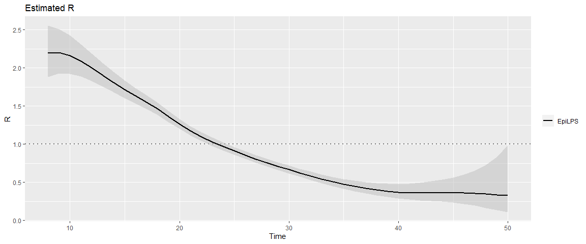
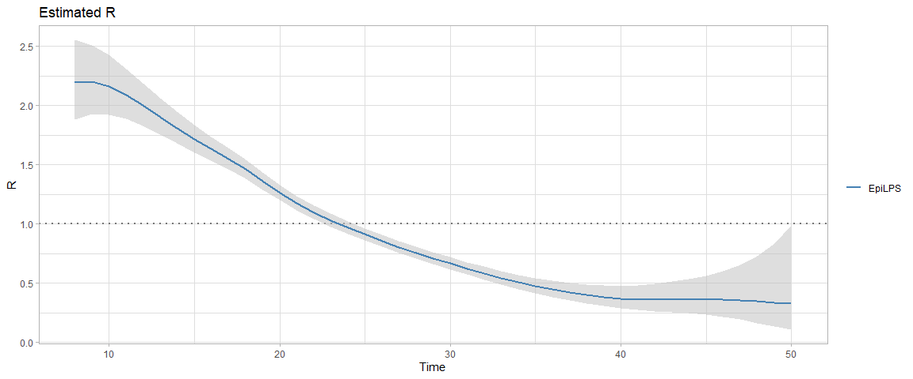

EpiLPS: a fast and flexible Bayesian tool for estimation of the
time-varying reproduction number
================
Oswaldo Gressani

<!-- Introduce badges -->


## Aim and scope

EpiLPS <span style="color: blue;"> (Gressani et al. 2022)</span>, is the
acronym for **Epi**demiological modeling (tool) with
**L**aplacian-**P**-**S**plines. It proposes a new Bayesian methodology
for estimating the instantaneous reproduction number $R_t$, i.e. the
average number of secondary cases generated by an infectious agent at
time $t$ <span style="color: blue;"> (White et al., 2020) </span>; a key
metric for assessing the transmission dynamics of an infectious disease
and a useful reference for guiding interventions of governmental
institutions in a public health crisis. The EpiLPS project builds upon
two strong pillars in the statistical literature, namely Bayesian
P-splines and Laplace approximations, to deliver a fast and flexible
methodology for inference on $R_t$. EpiLPS requires two (external)
inputs: (1) a time series of incidence counts and (2) a serial or
generation interval distribution.

The underlying model for smoothing incidence counts is based on the
Negative Binomial distribution to account for possible overdispersion in
the data. EpiLPS has a *two-phase engine* for estimating $R_t$. First,
Bayesian P-splines are used to smooth the epidemic curve and to compute
estimates of the mean incidence count of the susceptible population at
each day $t$ of the outbreak. Second, in the philosophy of <span
style="color: blue;"> Fraser (2007)</span>, the renewal equation is used
as a bridge to link the estimated mean incidence and the reproduction
number. As such, the second phase delivers a closed-form expression of
$R_t$ as a function of the B-spline coefficients and the serial interval
distribution.

Another key strength of EpiLPS is that two different strategies can be
used to estimate $R_t$. The first approach called LPSMAP is completely
sampling-free and fully relies on Laplace approximations and *maximum a
posteriori* computation of model hyperparameters for estimation.
Routines for Laplace approximations and B-splines evaluations are
typically the ones that are computationally most intensive and are
therefore coded in C++ and integrated in R via the [Rcpp
package](https://www.rcpp.org/), making them time irrelevant. The second
approach is called LPSMALA (Laplacian-P-splines with a
Metropolis-adjusted Langevin algorithm) and is fully stochastic. It
samples the posterior of the model by using Langevin diffusions in a
Metropolis-within-Gibbs framework. Of course, LPSMAP has a computational
advantage over LPSMALA. Thanks to the lightning fast implementation of
Laplace approximations, LPSMAP typically delivers estimate of $R_t$ in a
fraction of a second. The chart below, summarizes the skeleton and
mechanisms behind EpiLPS for estimating $R_t$.

<br> <!-- Include a white space -->


## Getting started

As the EpiLPS package includes C++ code, Windows users will need to
install Rtools to include the required compilers for a smooth
experience. Rtools is free and can be downloaded from
<https://cran.r-project.org/bin/windows/Rtools/>. To install the Github
version of EpiLPS (with
[devtools](https://cran.r-project.org/package=devtools)) type the
following lines in the R console:

``` r
install.packages("devtools")
devtools::install_github("oswaldogressani/EpiLPS")
```

The package can then be loaded as follows:

``` r
library("EpiLPS")
```

The EpiLPS package structure is fairly simple. The most important
routines are:

- `estimR()` The main routine to estimate the reproduction number.
- `plot.epilps()` S3 method to plot an object of class `epilps`.
- `episim()` A routine to simulate epidemic data.

## A simulated example

To simulate data with `episim()`, a serial interval distribution and a
pattern for the true reproduction number curve has to be specified. Six
patterns are available for the moment. The data generating process is
based on Poisson counts or negative binomial counts and the epidemic
renewal equation for establishing the link between the mean number of
infections and the reproduction number. The default duration of the
simulated outbreak is 50 days but other choices are possible. The code
below simulates an epidemic according to pattern 4 and gives summarizing
plots by setting the option `plotsim = TRUE`:

``` r
si <- c(0.12, 0.28, 0.30, 0.25, 0.05) # Specify a serial interval distribution
simepi <- episim(serial_interval = si, Rpattern = 4, plotsim = TRUE)
```



<br>

The simulated incidence count data can be accessed by typing:

``` r
simepi$y
```

    ##  [1]  10   6   5   8  22  17  25  40  47  63  91  96 138 169 170 234 259 297 333
    ## [20] 309 328 378 325 319 308 307 250 226 195 164 155 114  71  78  58  32  34  15
    ## [39]  18  11   7   3   6   1   3   2   1   0   1   0

The `estimR()` routine can be used to fit the epidemic data. By default,
the LPSMAP approach is used with 30 B-splines in the interval $[1;50]$
and a second order penalty. The `plot()` routine on the `epifit_LPSMAP`
object can be used to plot the estimated reproduction number.

``` r
epifit_LPSMAP <- estimR(incidence = simepi$y, si = si)
plot(epifit_LPSMAP)
```



<br>

Several options can be specified in the `plot()` routine. For instance,
graphical parameters such as `theme` and `col` can be used to control
the theme and color of the fitted $R_t$ curve. .

``` r
plot(epifit_LPSMAP, theme = "light", col = "steelblue")
```



<br>

Estimates related to $R(t)$ at days $t=8,\dots,14$ can be obtained by
typing:

``` r
knitr::kable(epifit_LPSMAP$RLPS[8:14,])
```

|     | Time |        R |      Rsd |  Rq0.025 |   Rq0.05 |   Rq0.25 |   Rq0.50 |   Rq0.75 |   Rq0.95 |  Rq0.975 |
|:----|-----:|---------:|---------:|---------:|---------:|---------:|---------:|---------:|---------:|---------:|
| 8   |    8 | 2.193090 | 1.338170 | 1.884390 | 1.930916 | 2.081532 | 2.193090 | 2.310628 | 2.490862 | 2.552363 |
| 9   |    9 | 2.200340 | 1.340516 | 1.930864 | 1.971849 | 2.103606 | 2.200340 | 2.301522 | 2.455307 | 2.507424 |
| 10  |   10 | 2.162081 | 1.315978 | 1.925088 | 1.961358 | 2.077401 | 2.162081 | 2.250214 | 2.383346 | 2.428251 |
| 11  |   11 | 2.090433 | 1.271223 | 1.891328 | 1.922010 | 2.019654 | 2.090433 | 2.163693 | 2.273615 | 2.310499 |
| 12  |   12 | 2.000352 | 1.215870 | 1.827079 | 1.853888 | 1.938943 | 2.000352 | 2.063706 | 2.158387 | 2.190058 |
| 13  |   13 | 1.903545 | 1.156483 | 1.757198 | 1.779944 | 1.851855 | 1.903545 | 1.956678 | 2.035729 | 2.062081 |
| 14  |   14 | 1.807216 | 1.097685 | 1.678729 | 1.698752 | 1.761926 | 1.807216 | 1.853671 | 1.922606 | 1.945538 |

## Real data examples

To illustrate EpiLPS on real data, we work with the Covid19 R Interface
Data Hub <https://covid19datahub.io/>. Four countries are considered
(Luxembourg, Italy, Canada and Japan) and the reproduction number is
estimated with LPSMAP over the period April 2020 - October 2021 with a
uniform serial interval over 5 days.

``` r
library("COVID19")

# Uniform serial interval over 5 days
si <- c(0.2, 0.2, 0.2, 0.2, 0.2)

# Luxembourg
Luxembourg <- covid19(country = "LUX", level = 1, verbose = FALSE)
dateLUX <- Luxembourg$date[75:649]
inciLUX <- Luxembourg$hosp[75:649]

# Italy
Italy <- covid19(country = "ITA", level = 1, verbose = FALSE)
dateITA <- Italy$date[42:616]
inciITA <- Italy$hosp[42:616]

# Canada
Canada <- covid19(country = "CAN", level = 1, verbose = FALSE)
dateCAN <- Canada$date[92:645]
inciCAN <- Canada$hosp[92:645]

# Japan
Japan<- covid19(country = "JPN", level = 1, verbose = FALSE)
dateJPN <- Japan$date[95:649]
inciJPN <- Japan$hosp[95:649]

# Fit with EpiLPS
epiLUX <- estimR(incidence = inciLUX, si = si)
epiITA <- estimR(incidence = inciITA, si = si)
epiCAN <- estimR(incidence = inciCAN, si = si)
epiJPN <- estimR(incidence = inciJPN, si = si)

gridExtra::grid.arrange(
plot(epiLUX, dates = dateLUX, datelab = "3m", tcol = "steelblue",
     title = "Estimated R Luxembourg"),
plot(epiITA, dates = dateITA, datelab = "3m", rtcol = "chartreuse4",
     title = "Estimated R Italy"),
plot(epiCAN, dates = dateCAN, datelab = "3m", rtcol = "brown2",
     title = "Estimated R Canada"),
plot(epiJPN, dates = dateJPN, datelab = "3m", rtcol = "darkorchid1",
     title = "Estimated R Japan"),
nrow = 2, ncol = 2)
```


## Package version

This is version 1.0.8 (2023-02-12) - “EpiLPS Kernels”.

## Acknowledgments

This project is funded by the European Union’s Research and Innovation
Action under the H2020 work programme, EpiPose (grant number 101003688).

## License

EpiLPS: a fast and flexible Bayesian tool for estimation of the
time-varying reproduction number. Copyright (C) 2021-2023 Oswaldo
Gressani.

This program is free software: you can redistribute it and/or modify it
under the terms of the GNU General Public License as published by the
Free Software Foundation, either version 3 of the License, or (at your
option) any later version.

This program is distributed in the hope that it will be useful, but
WITHOUT ANY WARRANTY; without even the implied warranty of
MERCHANTABILITY or FITNESS FOR A PARTICULAR PURPOSE. See the GNU General
Public License for more details.

You should have received a copy of the GNU General Public License along
with this program. If not, see <https://www.gnu.org/licenses/>.

## References

Gressani, O., Wallinga, J., Althaus, C. L., Hens, N. and Faes, C.
(2022). EpiLPS: A fast and flexible Bayesian tool for estimation of the
time-varying reproduction number. *PLoS Comput Biol* **18**(10):
e1010618. <https://doi.org/10.1371/journal.pcbi.1010618>

White, L. F., Moser, C. B., Thompson, R. N., & Pagano, M. (2021).
Statistical estimation of the reproductive number from case notification
data. *American Journal of Epidemiology*, **190**(4), 611-620.

Fraser C (2007) Estimating Individual and Household Reproduction Numbers
in an Emerging Epidemic. *PLoS ONE* **2**(8): e758.
<https://doi.org/10.1371/journal.pone.0000758>

Cori, A., Ferguson, N.M., Fraser, C., Cauchemez, S. (2013) A new
framework and software to estimate time-varying reproduction numbers
during epidemics, *American Journal of Epidemiology*, **178**(9),
1505–1512. <https://doi.org/10.1093/aje/kwt133>

<hr>
