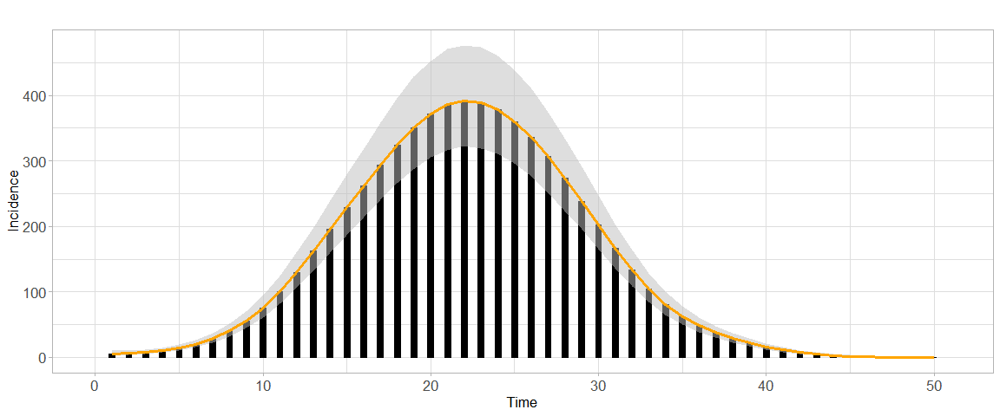
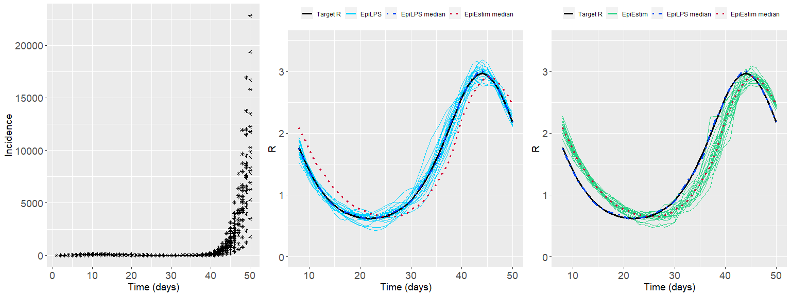

EpiLPS: a fast and flexible Bayesian tool for near real-time estimation
of the time-varying reproduction number
================
Oswaldo Gressani

<!-- Introduce badges -->


## Aim and scope

EpiLPS <span style="color: blue;"> (Gressani et al. 2021)</span>, is the
acronym for **Epi**demiological modeling (tool) with
**L**aplacian-**P**-**S**plines. It proposes a new Bayesian methodology
for estimating the instantaneous reproduction number *R*(*t*), i.e. the
average number of secondary cases generated by infectious agents at time
*t* <span style="color: blue;"> (White et al., 2020) </span>; a key
metric for assessing the transmission dynamics of an infectious disease
and a useful reference for guiding interventions of governmental
institutions in a public health crisis. The EpiLPS project builds upon
two strong pillars in the statistical literature, namely Bayesian
P-splines and Laplace approximations, to deliver a fast and flexible
methodology for inference on *R*(*t*). EpiLPS requires two (external)
inputs: (1) a time series of incidence counts and (2) a serial or
generation interval distribution.

The underlying model for smoothing incidence counts is based on the
Negative Binomial distribution to account for possible overdispersion in
the data. EpiLPS has a *two-phase engine* for estimating *R*(*t*).
First, Bayesian P-splines are used to smooth the epidemic curve and to
compute estimates of the mean incidence count of the susceptible
population at each day *t* of the outbreak. Second, in the philosophy of
<span style="color: blue;"> Fraser (2007)</span>, the renewal equation
is used as a bridge to link the estimated mean incidence and the
reproduction number. As such, the second phase delivers a closed-form
expression of *R*(*t*) as a function of the B-spline coefficients and
the serial interval distribution.

Another key strength of EpiLPS is that two different strategies can be
used to estimate *R*(*t*). The first approach called LPSMAP is
completely sampling-free and fully relies on Laplace approximations and
*maximum a posteriori* computation of model hyperparameters for
estimation. Routines for Laplace approximations and B-splines
evaluations are typically the ones that are computationally most
intensive and are therefore coded in C++ and integrated in R via the
[Rcpp package](http://www.rcpp.org/), making them time irrelevant. The
second approach is called LPSMALA (Laplacian-P-splines with a
Metropolis-adjusted Langevin algorithm) and is fully stochastic. It
samples the posterior of the model by using Langevin diffusions in a
Metropolis-within-Gibbs framework. Of course, LPSMAP has a computational
advantage over LPSMALA. Thanks to the lightning fast implementation of
Laplace approximations, LPSMAP typically delivers estimate of *R*(*t*)
in a fraction of a second. The chart below, summarizes the skeleton and
mechanisms behind EpiLPS for estimating *R*(*t*).

<br> <!-- Include a white space -->

<div class="figure" style="text-align: center">


<p class="caption">
The EpiLPS tool: path from incidence data and serial interval to the
estimated reproduction number.
</p>

</div>

## Getting started

As the EpiLPS package includes C++ code, Windows users will need to
install Rtools to include the required compilers for a smooth
experience. Rtools is free and can be downloaded from
<https://cran.r-project.org/bin/windows/Rtools/>. To install the Github
version of EpiLPS (with
[devtools](https://cran.r-project.org/package=devtools)) type the
following lines in the R console:

``` r
install.packages("devtools")
devtools::install_github("oswaldogressani/EpiLPS")
```

The package can then be loaded as follows:

``` r
library("EpiLPS")
```

The EpiLPS package structure is fairly simple. It has three main
routines and an S3 method for plots:

-   `epilps()` The main routine for model fit.
-   `plot.epilps()` S3 method to plot an object of class `epilps`.
-   `episim()` A routine to simulate epidemic data.
-   `perfcheck()` Checks the performance of `epilps()` via simulations.

## A simulated example

To simulate data with `episim()`, a serial interval distribution and a
pattern for the true reproduction number curve has to be specified. Four
patterns are available for the moment, namely 1: Constant *R*(*t*), 2:
Step function *R*(*t*), 3: Wiggly *R*(*t*) and 4:Decaying *R*(*t*)
curve. The data generating process is based on Poisson counts and the
epidemic renewal equation for establishing the link between the mean
number of infections and the reproduction number. The default duration
of the simulated outbreak is 50 days but other choices are possible. The
code below simulates an epidemic according to pattern 4 and gives
summarizing plots by setting the option `plotsim = TRUE`:

``` r
si <- c(0.12, 0.28, 0.30, 0.25, 0.05) # Specify a serial interval distribution
simepi <- episim(serial_interval = si, Rpattern = 4, plotsim = TRUE)
```


<br>

The simulated incidence count data can be accessed by typing:

``` r
simepi$y
```

    ##  [1]   16    4   18   22   47   50   68  104  134  178  228  287  363  456  546
    ## [16]  645  745  815  889  931  996 1000  966  960  888  844  746  654  560  478
    ## [31]  383  309  239  190  137  118   83   65   50   36   30   12   16    6    9
    ## [46]    5    4    1    5    1

The `epilps()` routine can be used to fit the epidemic data. By default,
the LPSMAP approach is used with 30 B-splines in the interval \[1; 50\]
and a second order penalty. The `plot()` routine on the `epifit_LPSMAP`
object can be used to plot the estimated reproduction number.

``` r
epifit_LPSMAP <- epilps(incidence = simepi$y, serial_interval = si, tictoc = TRUE)
```

    ## Inference method chosen: LPSMAP. 
    ## Total number of days: 50. 
    ## Mean R(t) discarding first 7 days: 0.971.
    ## Mean 95% CI of R(t) discarding first 7 days: (0.789,1.202) 
    ## Elapsed real time (wall clock time): 0.2 seconds.

``` r
plot(epifit_LPSMAP)
```


<br>

Several options can be specified in the `plot()` routine. For instance,
graphical parameters such as `themetype` and `rtcol` can be used to
control the theme and color of the fitted *R*(*t*) curve. In addition,
the option `overlayEpiestim` can be set to `TRUE` to overlay the
estimated *R*(*t*) curve with the EpiEstim package of <span
style="color: blue;"> Cori et al., (2013) </span>.

``` r
plot(epifit_LPSMAP, themetype = "light", rtcol = "steelblue", overlayEpiestim = TRUE)
```


<br>

The numerical values of the estimated *R*(*t*) at days *t* = 8, …, 14
obtained with LPSMAP and the associated 95% credible interval can be
obtained by typing:

``` r
knitr::kable(epifit_LPSMAP$epifit[8:14,2:4])
```

|     | R\_estim | R95CI\_low | R95CI\_up |
|:----|---------:|-----------:|----------:|
| 8   | 2.398584 |   1.966202 |  2.926049 |
| 9   | 2.302569 |   1.904284 |  2.784155 |
| 10  | 2.199451 |   1.819204 |  2.659177 |
| 11  | 2.098837 |   1.747610 |  2.520652 |
| 12  | 2.006398 |   1.667633 |  2.413980 |
| 13  | 1.922616 |   1.605188 |  2.302816 |
| 14  | 1.840623 |   1.533969 |  2.208581 |

A smooth estimate of the epidemic curve can be obtained with the code
below. The option `epicol` controls the color of the curve and
`incibars` can be set to *TRUE* or *FALSE* to show or not the bar plot
of the incidence counts.

``` r
plot(epifit_LPSMAP, plotout = "epicurve", themetype = "light", epicol = "orange", incibars = TRUE)
```



## Real data examples

To illustrate EpiLPS on real data, we work with the Covid19 R Interface
Data Hub <https://covid19datahub.io/>. Four countries are considered
(Luxembourg, Italy, Canada and Japan) and the reproduction number is
estimated with LPSMAP over the period April 2020 - October 2021 with a
uniform serial interval over 5 days. For Japan, option `overlayEpiestim`
is *TRUE* to compare the EpiLPS and EpiEstim fits.

``` r
library("COVID19")

# Uniform serial interval over 5 days
si <- c(0.2, 0.2, 0.2, 0.2, 0.2)

# Luxembourg
Luxembourg <- covid19(country = "LUX", level = 1, verbose = FALSE)
dateLUX <- Luxembourg$date[75:649]
inciLUX <- Luxembourg$hosp[75:649]

# Italy
Italy <- covid19(country = "ITA", level = 1, verbose = FALSE)
dateITA <- Italy$date[42:616]
inciITA <- Italy$hosp[42:616]

# Canada
Canada <- covid19(country = "CAN", level = 1, verbose = FALSE)
dateCAN <- Canada$date[71:645]
inciCAN <- Canada$hosp[71:645]

# Japan
Japan<- covid19(country = "JPN", level = 1, verbose = FALSE)
dateJPN <- Japan$date[75:649]
inciJPN <- Japan$hosp[75:649]

# Fit with EpiLPS
epiLUX <- epilps(incidence = inciLUX, serial_interval = si, verbose = FALSE)
epiITA <- epilps(incidence = inciITA, serial_interval = si, verbose = FALSE)
epiCAN <- epilps(incidence = inciCAN, serial_interval = si, verbose = FALSE)
epiJPN <- epilps(incidence = inciJPN, serial_interval = si, verbose = FALSE)

gridExtra::grid.arrange(
plot(epiLUX, dates = dateLUX, datelab = "3m", rtcol = "steelblue",
     Rtitle = "Estimated R Luxembourg"),
plot(epiITA, dates = dateITA, datelab = "3m", rtcol = "chartreuse4",
     Rtitle = "Estimated R Italy"),
plot(epiCAN, dates = dateCAN, datelab = "3m", rtcol = "brown2",
     Rtitle = "Estimated R Canada"),
plot(epiJPN, dates = dateJPN, datelab = "3m", rtcol = "darkorchid1",
     overlayEpiestim = TRUE, Rtitle = "Estimated R Japan"),
nrow = 2, ncol = 2)
```


## Validation

To check the (statistical) performance of EpiLPS, the `perfcheck()`
routine can be used to simulate epidemic outbreaks under four different
scenarios. Each scenario has a different *R*(*t*) curve to be compared
with the estimated trajectories fitted by EpiLPS. For comparative
reasons, the trajectories of EpiEstim (with a weekly sliding window) are
also shown. The code below simulates 25 epidemic outbreaks with a data
generating process following scenario 3 and a given serial interval
distribution. A seed can also be specified for reproducibility.

``` r
simexample <- perfcheck(S = 25, method = "LPSMALA",
                        serial_interval = c(0.2, 0.4, 0.2, 0.1, 0.1),
                        scenario = 3, ci_level = 0.95,  seed = 1234,
                        themetype = "gray")
```

<!-- -->

    ## Comparing LPSMALA vs EpiEstim in S=25 replications (epidemic T=50 days). 
    ## Mean Bias on days 8-50:
    ## -- EpiLPS mean Bias: -0.00206
    ## -- EpiEstim mean Bias: 0.04532
    ## Mean MSE on days 8-50:
    ## -- EpiLPS mean MSE:   0.0052
    ## -- EpiEstim mean MSE: 0.11407
    ## Mean credible interval coverage on days 8-50 (nominal level: 95 %):
    ## -- EpiLPS mean coverage:   94.51163
    ## -- EpiEstim mean coverage: 13.2093
    ## -- EpiLPS mean CI width: 0.22
    ## -- EpiEstim mean CI width: 0.18

## Package version

This is version 1.0.2 (2021-12-29) - “EpiLPS smoothing”.

## Acknowledgments

This project is funded by the European Union’s Research and Innovation
Action under the H2020 work programme, EpiPose (grant number 101003688).

## References

Gressani, O., Wallinga, J., Althaus, C., Hens, N. and Faes, C. (2021).
EpiLPS: a fast and flexible Bayesian tool for near real-time estimation
of the time-varying reproduction number. *MedRxiv preprint*,
<https://doi.org/10.1101/2021.12.02.21267189>

White, L. F., Moser, C. B., Thompson, R. N., & Pagano, M. (2021).
Statistical estimation of the reproductive number from case notification
data. *American Journal of Epidemiology*, **190**(4), 611-620.

Fraser C (2007) Estimating Individual and Household Reproduction Numbers
in an Emerging Epidemic. *PLoS ONE* **2**(8): e758.
<https://doi.org/10.1371/journal.pone.0000758>

Cori, A., Ferguson, N.M., Fraser, C., Cauchemez, S. (2013) A new
framework and software to estimate time-varying reproduction numbers
during epidemics, *American Journal of Epidemiology*, **178**(9),
1505–1512. <https://doi.org/10.1093/aje/kwt133>

<hr>
